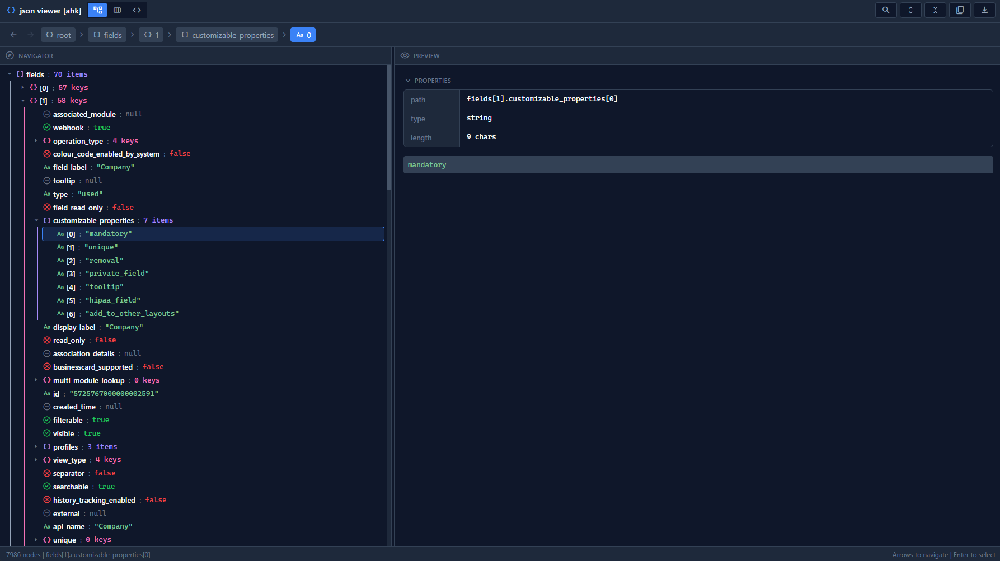
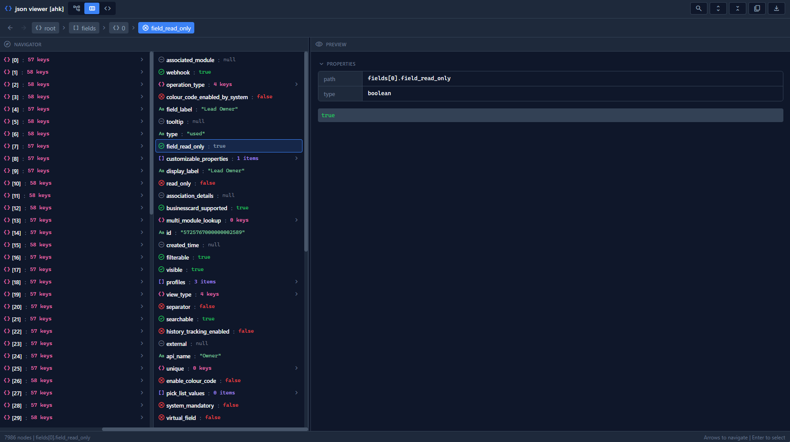
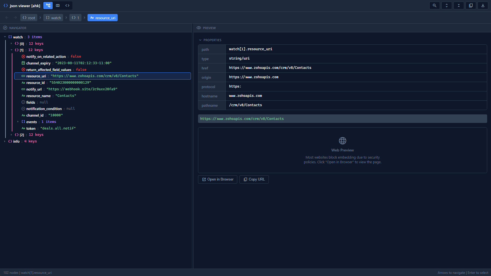
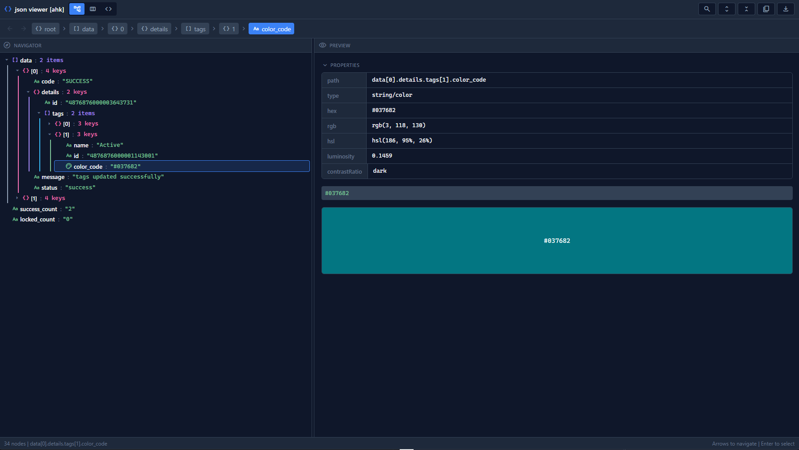
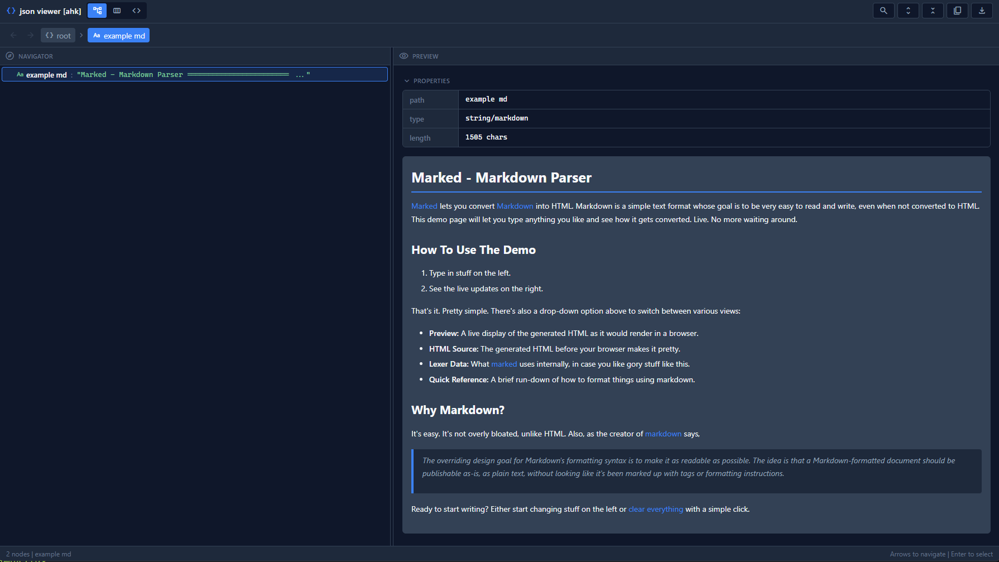
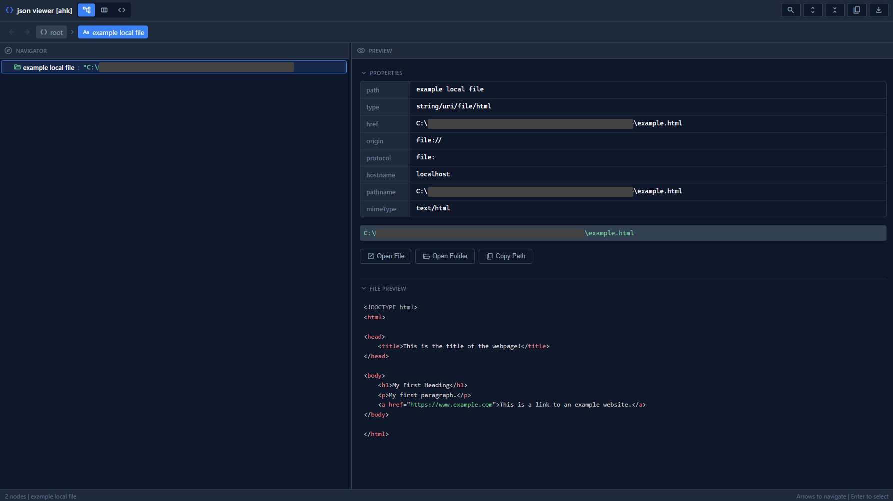
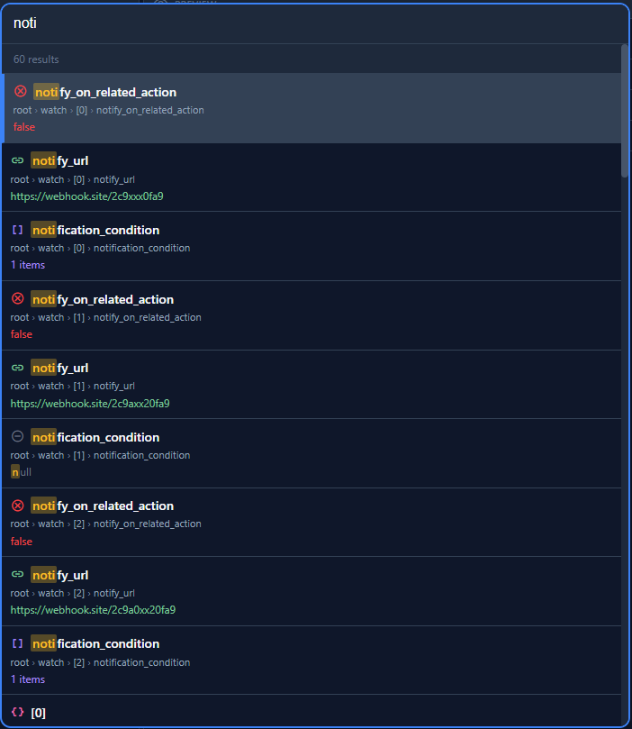

#  JSON Viewer for AutoHotkey v2

A JSON viewer built with AutoHotkey v2 and WebView2. This tool provides an interface for exploring, searching, and analyzing JSON data.



## Features

###  View Modes
 
- **Tree View**  Hierarchical expandable/collapsible tree with colored depth indicators
- **Column View**  Miller columns navigation
- **JSON View**  Syntax-highlighted raw JSON with Prism.js

###  Data Type Detection
Automatically detects and provides rich previews for:
- **URLs** - Clickable links with Open in Browser button, image preview for image URLs
- **File Paths** - Open File/Folder buttons, file content preview
- **Colors** - Color swatch with hex/rgb/hsl conversions and luminosity info
- **Dates** - Formatted display with interactive calendar view
- **Markdown** - Rendered markdown with syntax highlighting for code blocks
- **Booleans** - Green checkmark (true) / Red X (false) icons
- **Numbers** - Integer/float detection

###  Search
- Fuzzy search across keys, values, and paths
- Multi-word matching (e.g., "web site" matches "webhook.site")
- Highlighted search results with breadcrumb paths
- Keyboard navigation through results

###  Context Menu & Actions
- Copy path, value, or entire object as JSON
- Export selected node or entire JSON to file
- Click any value in Properties panel to copy

###  Visual Features
- Dark theme optimized for readability
- Color-coded data types
- Resizable panels
- Breadcrumb navigation with back/forward history
- Collapsible Properties and File Preview sections

###  Keyboard Shortcuts
| Key | Action |
|-----|--------|
| `1` | Switch to Tree View |
| `2` | Switch to Column View |
| `3` | Switch to JSON View |
| `↑` `↓` | Navigate items |
| `←` `→` | Navigate hierarchy / Expand/Collapse |
| `Enter` | Select current node (when submit_on_enter enabled) |
| `Ctrl+F` | Open search |
| `Escape` | Close search |
| `E` | Expand all nodes |
| `C` | Collapse all nodes |

##  Requirements

- AutoHotkey v2.0+
- [WebView2](https://github.com/thqby/ahk2_lib/tree/master/WebView2) library for AHK v2
- [cJSON](https://github.com/G33kDude/cJson.ahk) library for JSON parsing
- Microsoft Edge WebView2 Runtime (usually pre-installed on Windows 10/11)

##  Installation

1. Download `json_viewer.v2.ahk` and place it in your script or library folder
2. Ensure WebView2.ahk is in your library path
3. Include the script in your project:
```autohotkey
#include <json_viewer>
```

## Usage

#### Open with an AHK object
```autohotkey
#Requires AutoHotkey v2.0+
#include <json_viewer>

data := Map(
    'name', 'John Doe',
    'age', 30,
    'active', true,
    'website', 'https://example.com',
    'config_path', 'C:\Users\John\config.json'
)

json_viewer(data)
```

#### Open from a local JSON file
```autohotkey
#Requires AutoHotkey v2.0+
#include <json_viewer>

json_viewer('C:\path\to\data.json')
```

#### Open with options
```autohotkey
; custom window size and title
result := json_viewer(data, {
    width: 1400,
    height: 900,
    title: 'API Response Viewer'
})

; enable submit on enter key (returns selected node)
result := json_viewer(data, {
    submit_on_enter: true
})

if result.selected {
    MsgBox('Selected: ' result.selected)
}
```

#### Options Reference

| Option | Type | Default | Description |
|--------|------|---------|-------------|
| `width` | Number | 70% of screen | Window width in pixels |
| `height` | Number | 70% of screen | Window height in pixels |
| `title` | String | `'json viewer [ahk]'` | Window title |
| `view` | String | `'tree'` | Initial view: `'tree'`, `'column'`, or `'json'` |
| `submit_on_enter` | Boolean | `false` | Return selected node when Enter is pressed |

#### Return Value

The function returns an object with a `selected` property:
```autohotkey
result := json_viewer(data, {submit_on_enter: true})

; result.selected contains the selected value when enter was pressed
; result.selected is empty string if window was closed without selection
```

## Examples

#### Viewing API Responses
```autohotkey
#include <json_viewer>
#include <WinHttpRequest>  ; your http library

response := HttpGet('https://api.example.com/users')
json_viewer(response, {title: 'API Response'})
```

#### Debugging Complex Objects
```autohotkey
#include <json_viewer>

my_complex_object := Map(
    'settings', Map(
        'theme', 'dark',
        'notifications', true,
        'api_endpoint', 'https://api.example.com'
    ),
    'users', [
        Map('id', 1, 'name', 'Alice', 'created', '2024-01-15'),
        Map('id', 2, 'name', 'Bob', 'created', '2024-02-20')
    ],
    'metadata', Map(
        'version', '1.0.0',
        'config_file', 'C:\App\config.json',
        'primary_color', '#3b82f6'
    )
)

json_viewer(my_complex_object, {title: 'Debug View'})
```

#### File Path Preview

When a string value is detected as a file path, the viewer provides:
- File existence check
- Open File / Open Folder buttons
- File content preview for supported types:
  - **Images**: PNG, JPG, GIF, WebP, SVG, ICO, BMP
  - **Audio**: MP3, WAV, OGG, M4A (with playback controls)
  - **Text/Code**: TXT, MD, JSON, XML, HTML, CSS, JS, PY, AHK, and more
  - **Markdown**: Rendered with full formatting support
```autohotkey
; paths are automatically detected and rendered in the preview panel
data := Map(
    'config', 'C:\MyApp\config.json',
    'readme', 'D:\Projects\README.md',
    'icon', 'C:\Icons\app.png'
)

json_viewer(data)
```

## Screenshots

#### Tree View with Type Detection


#### Column View Navigation


#### URL Preview


#### Color Preview


#### Date Preview with Calendar


#### Markdown Rendering


#### File Path with Content Preview


#### Search with Fuzzy Matching


## Handling Booleans and Null

AutoHotkey doesn't have native `true`, `false`, or `null` values that map directly to JSON. When working with JSON data:

**Creating data manually**: Use a JSON library like cJSON that creates special marker objects:
```autohotkey
; use JSON.true / JSON.false / JSON.null with cJSON to properly render true / false / null values
data := JSON.Load('{"active": JSON.true, "deleted": JSON.false, "value": JSON.null}')
```

**Loading JSON from a file/string**: json_viewer assumes you are using the cJSON library and sets the cJSON JSON.BoolsAsInts and JSON.NullsAsStrings to false. This ensures that true / false / null values are encoded correctly.


## Customization

The viewer uses CSS custom properties for theming. Key colors can be modified in the `_html_template()` method:
```css
:root {
    --bg-primary: #0f172a;
    --bg-secondary: #1e293b;
    --accent: #3b82f6;
    --type-string: #7ec699;
    --type-url: #7ec699;
    --type-number: #fbbf24;
    --type-boolean-true: #22c55e;
    --type-boolean-false: #ef4444;
    --type-null: #6b7280;
    --type-object: #f472b6;
    --type-array: #a78bfa;
}
```

## Dependencies & Credits

- [WebView2 for AHK v2](https://github.com/thqby/ahk2_lib/tree/master/WebView2) - WebView2 wrapper
- [cJSON](https://github.com/G33kDude/cJson.ahk) - Library for JSON parsing
- [Prism.js](https://prismjs.com/) - Syntax highlighting
- [Marked.js](https://marked.js.org/) - Markdown parsing
- [Material Symbols](https://fonts.google.com/icons) - Icons
- Inspired by [JSON Hero](https://jsonhero.io/)

## License

MIT License - Feel free to use, modify, and distribute.